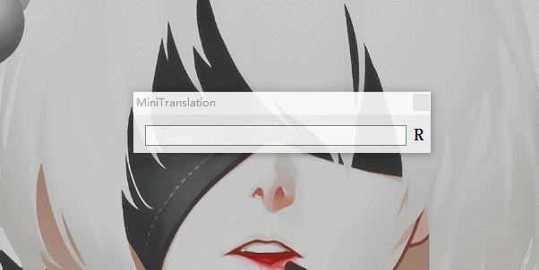

# MiniTranslation

迷你 AI 翻译软件：常驻系统托盘，一个热键呼出，中英互译。

翻译由大模型完成，支持任何 OpenAI 接口格式兼容的服务（OpenAI / DeepSeek / Kimi / Ollama 本地模型等）。

## 使用

- `Alt+Q`：显示 / 隐藏窗口，可在设置中修改
- `回车`：翻译（自动判断中译英 / 英译中）
- `Tab` 或点击“朗读”：朗读英文
- `Esc`：隐藏窗口

首次使用请在托盘图标右键菜单打开“设置”，填写 API 地址、API Key 和模型，例如：

| 服务 | API 地址 | 模型示例 |
| --- | --- | --- |
| DeepSeek | `https://api.deepseek.com/v1` | `deepseek-chat` |
| OpenAI | `https://api.openai.com/v1` | `gpt-4o-mini` |
| Ollama（本地） | `http://localhost:11434/v1` | `qwen3` |

配置保存在 `%AppData%\MiniTranslation\settings.json`。



## 下载

从 [Releases](../../releases) 下载：

- `MiniTranslation-Setup.exe`：安装包（按当前用户安装，可勾选开机自启）
- `MiniTranslation-win-x64.zip`：绿色版，解压即用

两者均自包含 .NET 运行时，无需额外安装。

## 构建

需要 .NET 10 SDK：

```bash
dotnet publish -c Release -r win-x64 --self-contained -p:PublishSingleFile=true -p:EnableCompressionInSingleFile=true
```

推送 `v*` 格式的 tag（如 `v2.0.0`）会自动构建 zip 与安装包并发布 GitHub Release。
